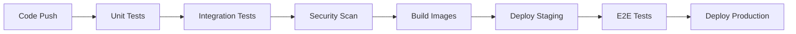

# Backend-Cabs-Booking-System 🚗

A complete backend system for a **Cabs Booking System** built with **NodeJs**, **Express.js**, **MongoDB**, **Kafka**, **Redis** and **Docker**. This system provides robust authentication, ride management, and profile management features for both users and drivers. Built with modern technologies including Kafka for real-time event processing, Redis for caching, and Docker for containerization.

## 🌟 Features

### User Authentication & Management
- **Advanced Authentication** 📝
  - Multi-factor authentication (Email/SMS)
  - OAuth2.0 integration (Google, Facebook)
  - JWT with refresh token mechanism
  - Session management with Redis
  - Rate limiting and brute force protection

### Captain Authentication & Management
- **Comprehensive Driver System** 🚘
  - Document verification workflow
  - Vehicle registration and validation
  - Real-time availability tracking
  - Performance metrics and ratings
  - Earnings management and analytics

### Ride Management
- **Intelligent Booking System** 🎯
  - Smart driver allocation using geohashing
  - Real-time fare calculation
  - Dynamic pricing based on demand
  - Route optimization
  - ETA prediction using ML models

### Real-time Features
- **Advanced Real-time Capabilities** ⚡
  - Live location tracking with WebSocket
  - Real-time notifications (Kafka)
  - In-app messaging system
  - Live fare updates
  - SOS alert system

### Analytics & Reporting
- **Business Intelligence** 📊
  - Ride analytics and insights
  - Revenue reports
  - Driver performance metrics
  - User behavior analysis
  - Peak hour predictions

## 🏗️ Architecture

### Microservices Architecture
```
┌─────────────────┐     ┌─────────────────┐     ┌─────────────────┐
│   API Gateway   │────▶│  Auth Service   │────▶│  User Service   │
└─────────────────┘     └─────────────────┘     └─────────────────┘
        │                       │                        │
        │               ┌─────────────────┐             │
        └──────────────▶│  Ride Service   │◀────────────┘
                       └─────────────────┘
                              │
                    ┌─────────────────────┐
                    │   Driver Service    │
                    └─────────────────────┘
```

### Tech Stack Details

#### Core Services
- **API Gateway**: Express.js with rate limiting
- **Auth Service**: JWT, OAuth2.0, Redis sessions
- **User Service**: MongoDB, Redis cache
- **Ride Service**: Kafka, MongoDB
- **Driver Service**: MongoDB, Redis

#### Data Storage
- **MongoDB**
  - Sharded clusters
  - Replica sets for HA
  - Time-series collections for metrics
- **Redis**
  - Cluster mode
  - Persistence enabled
  - Cache policies

#### Message Broker
- **Apache Kafka**
  - Multi-broker setup
  - Topic partitioning
  - Message compression
  - Dead letter queues

## 🛠️ Development Setup

### Prerequisites
```bash
Node.js >= 16.x
MongoDB >= 5.0
Redis >= 6.0
Kafka >= 3.0
Docker >= 20.10
Docker Compose >= 2.0
```

### Environment Configuration
```bash
# Core
NODE_ENV=development
PORT=3000
LOG_LEVEL=debug

# MongoDB
MONGO_URI=mongodb://localhost:27017/cab_booking
MONGO_REPLICA_SET=rs0

# Redis
REDIS_URL=redis://localhost:6379
REDIS_PASSWORD=your_password
REDIS_CLUSTER_URLS=["redis://redis-1:6379","redis://redis-2:6379"]

# Kafka
KAFKA_BROKERS=localhost:9092,localhost:9093
KAFKA_CLIENT_ID=cab_booking_service
KAFKA_GROUP_ID=cab_booking_group

# JWT
JWT_SECRET=your_jwt_secret
JWT_REFRESH_SECRET=your_refresh_secret
JWT_EXPIRY=1h
JWT_REFRESH_EXPIRY=7d

# Services
AUTH_SERVICE_URL=http://localhost:3001
USER_SERVICE_URL=http://localhost:3002
RIDE_SERVICE_URL=http://localhost:3003
DRIVER_SERVICE_URL=http://localhost:3004
```

## 📚 API Documentation

### Authentication API
```typescript
POST /api/v1/auth/register     - Register new user
POST /api/v1/auth/login        - Login user
POST /api/v1/auth/refresh      - Refresh token
POST /api/v1/auth/logout       - Logout user
POST /api/v1/auth/verify-otp   - Verify OTP
```

### User API
```typescript
GET    /api/v1/users/profile           - Get user profile
PUT    /api/v1/users/profile           - Update profile
GET    /api/v1/users/rides             - Get ride history
POST   /api/v1/users/payment-methods   - Add payment method
GET    /api/v1/users/payment-methods   - Get payment methods
```

### Driver API
```typescript
POST   /api/v1/drivers/register        - Register as driver
PUT    /api/v1/drivers/status          - Update availability
GET    /api/v1/drivers/earnings        - Get earnings
GET    /api/v1/drivers/performance     - Get performance metrics
POST   /api/v1/drivers/documents       - Upload documents
```

### Ride API
```typescript
POST   /api/v1/rides/estimate          - Get fare estimate
POST   /api/v1/rides/book              - Book ride
PUT    /api/v1/rides/:id/status        - Update ride status
GET    /api/v1/rides/:id/track         - Track ride
POST   /api/v1/rides/:id/cancel        - Cancel ride
POST   /api/v1/rides/:id/rate          - Rate ride
```

## 🔒 Security Measures

### Authentication
- JWT with refresh token rotation
- Rate limiting per IP and user
- Request signing for API authentication
- OAuth2.0 implementation
- Multi-factor authentication

### Data Protection
- End-to-end encryption for messages
- PII data encryption at rest
- Secure session management
- HTTPS enforcement
- XSS protection
- CSRF protection

### Infrastructure
- Container security scanning
- Secrets management
- Network isolation
- Regular security audits
- Automated vulnerability scanning

## 🐳 Docker Infrastructure

### Services Architecture
```yaml
services:
  api-gateway:
    scale: 2
    
  auth-service:
    scale: 2
    
  user-service:
    scale: 2
    
  ride-service:
    scale: 3
    
  driver-service:
    scale: 2

  mongodb:
    cluster: true
    replicas: 3
    
  redis:
    cluster: true
    nodes: 3
    
  kafka:
    brokers: 3
    zookeeper: 3
```

## 📊 Monitoring & Logging

### Metrics Collection
- Prometheus metrics
- Grafana dashboards
- ELK stack integration
- Custom business metrics
- Performance monitoring

### Log Management
- Centralized logging
- Log rotation
- Error tracking
- Audit logging
- Transaction tracing

## 🚀 CI/CD Pipeline




