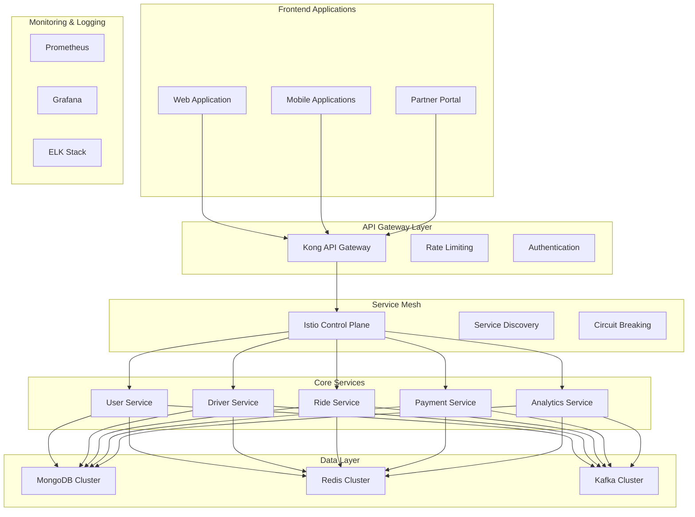
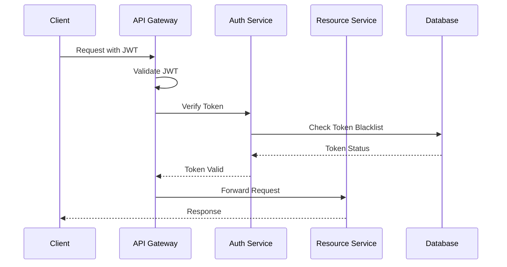

# Enterprise Cab Booking System Backend Architecture

[](https://travis-ci.org/username/repo)
[](https://coveralls.io/github/username/repo?branch=master)
[](https://hub.docker.com/r/username/repo)
[](https://opensource.org/licenses/MIT)

## System Architecture Overview

Enterprise-grade cab booking system implementing a distributed microservices architecture with event-driven design patterns, built on Node.js ecosystem.

### Core Technology Stack

| Layer | Technologies |
|-------|--------------|
| Runtime Environment | Node.js (v16.x) |
| API Framework | Express.js |
| Database | MongoDB (Sharded Cluster) |
| Caching | Redis (Cluster Mode) |
| Message Broker | Apache Kafka |
| Container Platform | Docker, Kubernetes |
| Service Mesh | Istio |
| API Gateway | Kong |
| Load Balancer | NGINX |

### System Components



## Microservices Architecture

### Service Decomposition

| Service | Responsibility | Tech Stack | Database |
|---------|---------------|------------|-----------|
| User Service | User management, authentication | Node.js, Express.js | MongoDB |
| Driver Service | Driver management, verification | Node.js, Express.js | MongoDB |
| Ride Service | Ride booking, tracking | Node.js, Express.js, Kafka | MongoDB |
| Payment Service | Payment processing, wallet | Node.js, Express.js | MongoDB |
| Analytics Service | Business intelligence | Node.js, Express.js | MongoDB |

### Inter-Service Communication

#### Synchronous Communication
- REST APIs with Circuit Breaker pattern
- gRPC for high-performance services
- GraphQL for aggregation layer

#### Asynchronous Communication
- Event-driven architecture using Kafka
- Message queuing with dead letter queues
- Event sourcing for state management

## Data Architecture

### Database Schema

#### User Collection
```typescript
interface User {
  _id: ObjectId;
  email: string;
  phoneNumber: string;
  password: string;
  profile: {
    firstName: string;
    lastName: string;
    avatar: string;
  };
  verification: {
    isEmailVerified: boolean;
    isPhoneVerified: boolean;
    documents: Document[];
  };
  security: {
    mfaEnabled: boolean;
    lastLogin: Date;
    loginAttempts: number;
  };
  metadata: {
    createdAt: Date;
    updatedAt: Date;
    lastActive: Date;
  };
}
```

#### Ride Collection
```typescript
interface Ride {
  _id: ObjectId;
  userId: ObjectId;
  driverId: ObjectId;
  status: RideStatus;
  location: {
    pickup: GeoJSON;
    dropoff: GeoJSON;
    currentLocation?: GeoJSON;
  };
  pricing: {
    basePrice: number;
    surgeMultiplier: number;
    tax: number;
    total: number;
  };
  metadata: {
    createdAt: Date;
    updatedAt: Date;
    completedAt?: Date;
  };
}
```

### Caching Strategy

#### Redis Implementation
```typescript
interface CacheConfig {
  driver: 'redis';
  cluster: {
    nodes: string[];
    options: {
      scaleReads: 'all' | 'master' | 'slave';
      maxRedirections: number;
      retryDelayOnFailover: number;
    };
  };
  options: {
    prefix: string;
    ttl: number;
    maxMemory: string;
    evictionPolicy: 'allkeys-lru' | 'volatile-lru';
  };
}
```

## System Configurations

### Kubernetes Deployment

```yaml
apiVersion: apps/v1
kind: Deployment
metadata:
  name: cab-booking-service
spec:
  replicas: 3
  selector:
    matchLabels:
      app: cab-booking
  template:
    metadata:
      labels:
        app: cab-booking
    spec:
      containers:
      - name: cab-booking
        image: cab-booking:latest
        resources:
          limits:
            cpu: "1"
            memory: "1Gi"
          requests:
            cpu: "500m"
            memory: "512Mi"
        livenessProbe:
          httpGet:
            path: /health
            port: 3000
        readinessProbe:
          httpGet:
            path: /ready
            port: 3000
```

### Environment Configuration

```typescript
interface EnvironmentConfig {
  app: {
    name: string;
    version: string;
    environment: 'development' | 'staging' | 'production';
    port: number;
    apiVersion: string;
  };
  mongodb: {
    uri: string;
    options: {
      replicaSet: string;
      readPreference: string;
      maxPoolSize: number;
    };
  };
  redis: {
    cluster: boolean;
    nodes: string[];
    password: string;
    keyPrefix: string;
  };
  kafka: {
    clientId: string;
    brokers: string[];
    ssl: boolean;
    sasl: {
      mechanism: 'plain' | 'scram-sha-256' | 'scram-sha-512';
      username: string;
      password: string;
    };
  };
  jwt: {
    secret: string;
    refreshSecret: string;
    accessExpiry: string;
    refreshExpiry: string;
  };
}
```

## Security Implementation

### Authentication Flow



### Security Measures

#### API Security
- Rate limiting per IP and user
- JWT with refresh token rotation
- Request signing
- API key management
- Input validation and sanitization

#### Data Security
- End-to-end encryption
- Data at rest encryption
- PII data handling
- GDPR compliance
- Data retention policies

#### Infrastructure Security
- Network segmentation
- Container security
- Secrets management
- Regular security audits
- Vulnerability scanning

## Performance Optimization

### Caching Strategy
- Multi-level caching
- Cache invalidation patterns
- Cache warming
- Cache hit ratio monitoring
- Distributed caching

### Database Optimization
- Indexing strategy
- Query optimization
- Connection pooling
- Sharding strategy
- Read replicas

## Monitoring & Observability

### Metrics Collection
```typescript
interface MetricsConfig {
  prometheus: {
    endpoint: string;
    prefix: string;
    defaultLabels: Record<string, string>;
  };
  metrics: {
    http: {
      requestDuration: boolean;
      requestSize: boolean;
      responseDuration: boolean;
      responseSize: boolean;
    };
    business: {
      activeRides: boolean;
      completedRides: boolean;
      cancelledRides: boolean;
      revenue: boolean;
    };
  };
}
```

### Logging Configuration
```typescript
interface LogConfig {
  level: 'debug' | 'info' | 'warn' | 'error';
  format: 'json' | 'pretty';
  destination: 'console' | 'file' | 'elastic';
  retention: string;
  compression: boolean;
}
```

## Development & Deployment

### CI/CD Pipeline
1. Code Quality
   - Static code analysis
   - Unit testing
   - Integration testing
   - Code coverage
   - Security scanning

2. Build Process
   - Multi-stage Docker builds
   - Image vulnerability scanning
   - Image signing
   - Registry push

3. Deployment
   - Blue-green deployment
   - Canary releases
   - Rollback strategy
   - Health monitoring

## Documentation & Support

### API Documentation
- OpenAPI 3.0 specification
- Postman collection
- Integration examples
- Rate limit documentation
- Error handling guide

### Support Channels
- Technical documentation
- API reference
- Integration guide
- Troubleshooting guide
- Support portal

## License

This project is licensed under the MIT License - see the [LICENSE](LICENSE) file for details.

---

For detailed documentation, visit [docs.cabbooking.com](https://docs.cabbooking.com)


